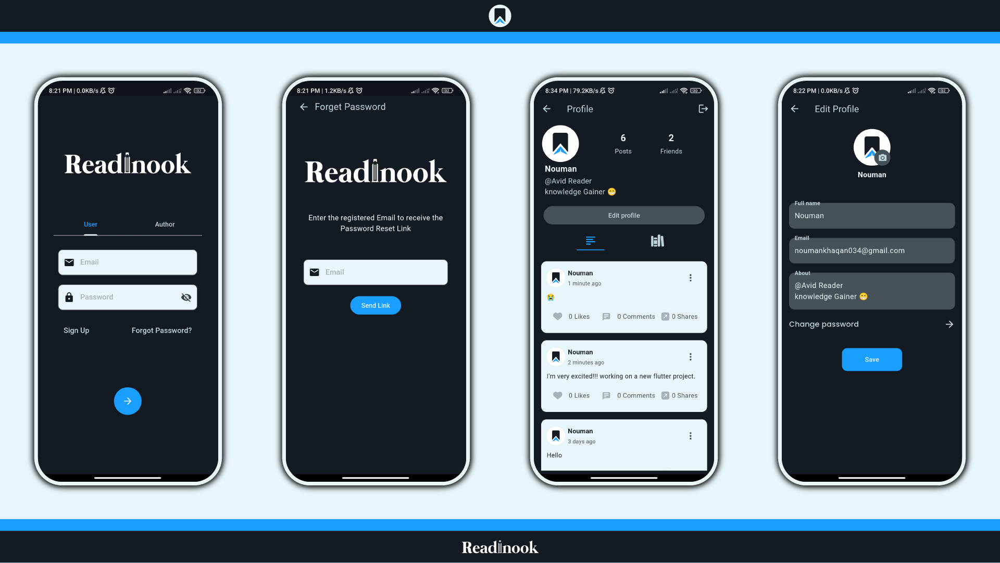
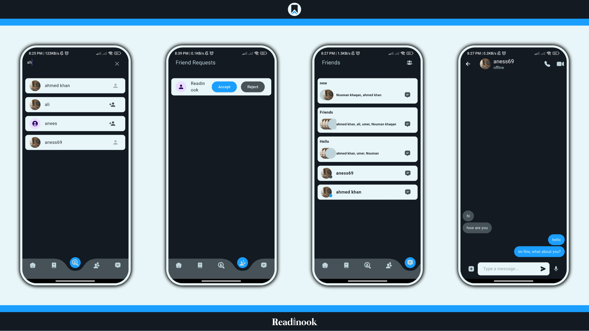
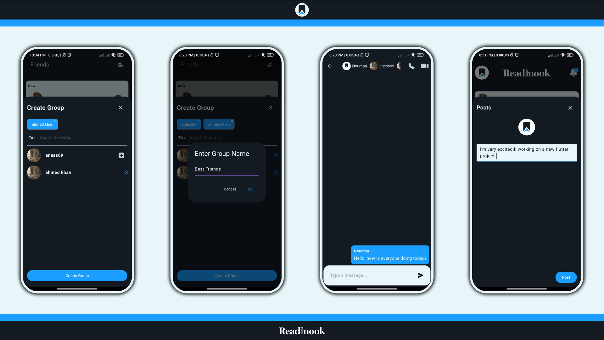
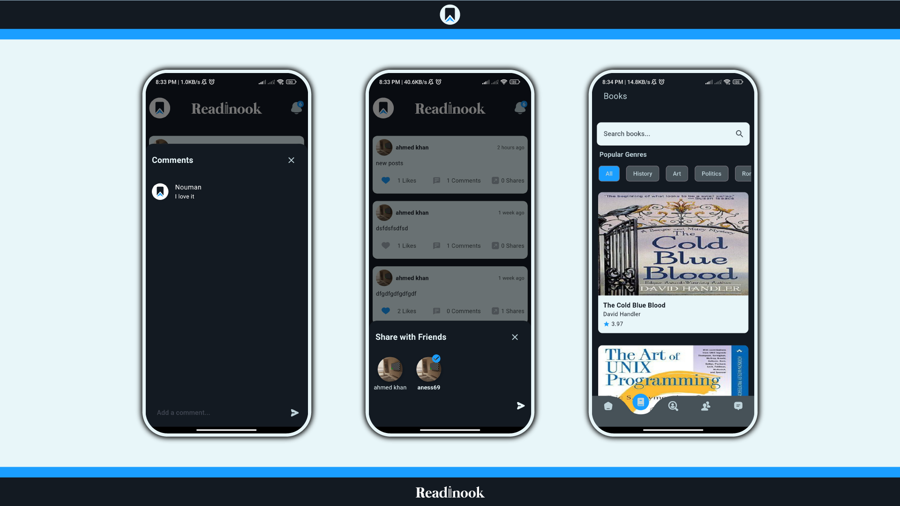
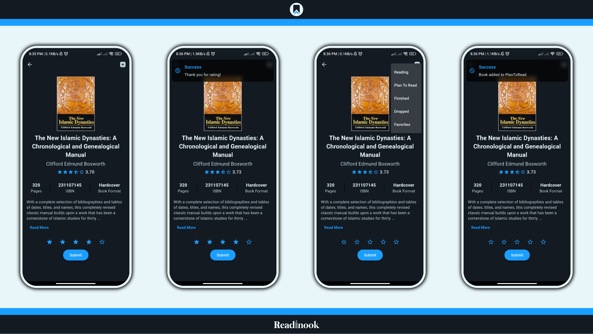
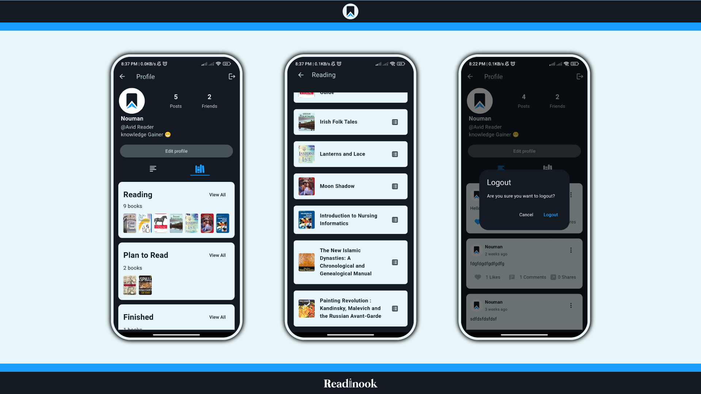

# 📚 Readinook – Smart Book Reading & Review App  


---

## 🚀 Overview  
**Readinook** is a modern Flutter-based mobile application that allows users to explore books, search titles, and share reviews with a reading community. It provides a smooth and interactive experience using Firebase for backend services.

---

## ✨ Features  
- 📖 Browse books from different categories  
- 🔍 Search books
- ⭐ Add reviews and ratings  
- 👤 User profile management  
- ☁️ Firebase integration (Auth + Database)  
- 📱 Smooth Android experience  

---

## 📸 Screenshots  

### 🖼️ App Preview  
<p align="center">
  
  
  
</p>

<p align="center">
  
  
  
</p>

<p align="center">
  
</p>

---

## 🛠️ Tech Stack  
- **Frontend:** Flutter  
- **Backend:** Firebase  
- **Language:** Dart  

---

## ⚙️ Installation  

### 1️⃣ Clone Repository  
```bash
git clone https://github.com/Nomikhan56/readinook.git
cd readinook